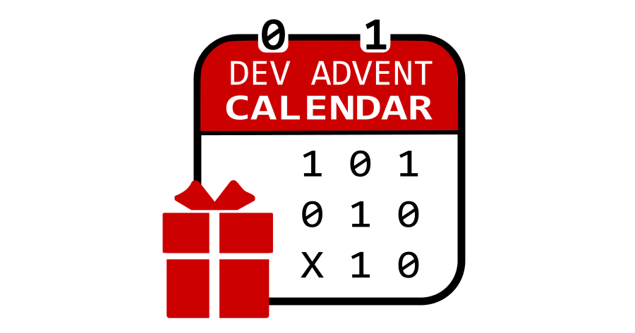

# DevAdventCalendar

DevAdventCalendar web app for online competition for programmers : [www.devadventcalendar.pl](www.devadventcalenar.pl)

|Environment |Build  |Deployment| Quality | Coverage |
|:----------:|:-----:|:--------:|:-------:|:--------:|
| PROD | | | ||
| DEV | | | ||

## Projects in solution

- **DevAdventCalendarCompetition** - main project with Controllers and Views
- **DevAdventCalendarCompetition.Services** - class library for logic operations
- **DevAdventCalendarCompetition.Repository** - class library for database operations
- **DevAdventCalendarCompetition.Tests** - unit and integration tests that covers services and controllers (xUnit)

- **DevAdventCalendarCompetition.TestResultService** - external service calculating user points based on a custom algorithm
- **DevAdventCalendarCompetition.TestResultService.Tests** - unit tests for TestResultService (xUnit)

## Contributing

Please read [CONTRIBUTING.md](https://github.com/DevAdventCalendar/DevAdventCalendar/blob/develop/CONTRIBUTING.md) for details.

## Suggest a new feature

We use GitHub issues to track public features. Suggest a new feature by opening a new issue (the template has already been created, simply complete it).

## Report bug

We use GitHub issues to track public bugs. Report a bug by opening a new issue of type bug (the template has already been created, simply complete it).

## Used Tools

### Docker

Docker is an open platform that enables developers and administrators to build images, ship, and run distributed applications in a loosely isolated environment called a container. This approach enables efficient application lifecycle management between development, QA, and production environments.

Application is using Docker to work on VPS. Additional Docker-compose helping with configure for all of this

[Docker documentation](https://docs.microsoft.com/pl-pl/dotnet/core/docker/intro-net-docker)

### Swagger

Useful tool to check api endpoints. It is  generated based on Controllers and attributes and can test any rest calls from this page.
Can be access by: pagedomain (or localhost)/swagger/. [Swagger documentation](https://docs.microsoft.com/pl-pl/aspnet/core/tutorials/web-api-help-pages-using-swagger?view=aspnetcore-2.1)

#### MailHog

MailHog is an email testing tool for developers. More info on [GitHub](https://github.com/mailhog/MailHog) page.
